# FOG_V2 APPLICATION使用

## 说明

该嵌入式设备端源码支持硬件型号：EMW3165、EMW3166、EMW3239、EMW3031、MiCOKit-3165、MiCOKit-3166、MiCOKit-3239、NUCLEO-F411RE。


## 准备工作
### MiCOKit开发套件
（包括：上层扩展板 和 底层开发主板）

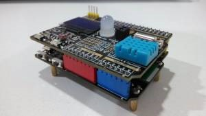

### 手机APP MiCO 总动员
扫描下方二维码，下载并安装手机 APP -  MiCO 总动员。（左：IOS；右：Android）

    

## 开始使用
### [Fog云端](https://v2.fogcloud.io/) 注册
产品注册的步骤就是得到云端后台得到一个唯一的Product ID。一个开发者账号，可以在云端注册多个Product ID。点击产品管理，进行产品的创建，按照引导的步骤得到Product ID。
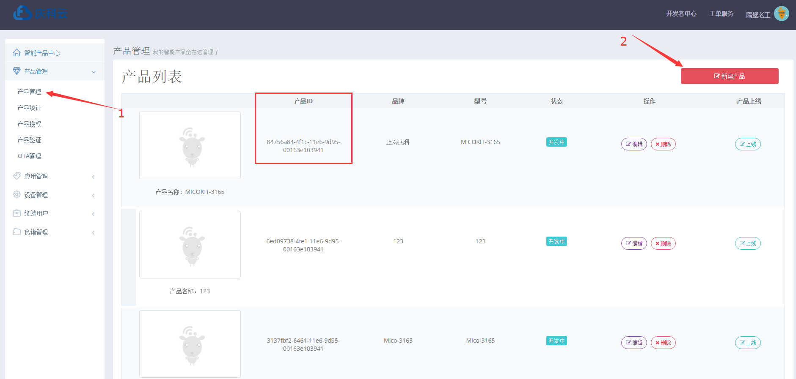

### 连接开发板
（1）请将开发板上的 SW 开关均置于OFF，系统默认执行 Application 模式。如图：

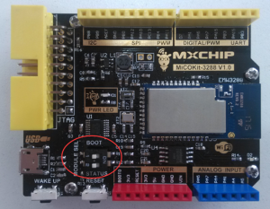

（2）插好上层扩展板，使用miniUSB连接线，将开发板上的USB口连接到PC。这样既可以通过PC的串口工具查看设备运行Log，也可以为设备提供5V工作电压。如图：

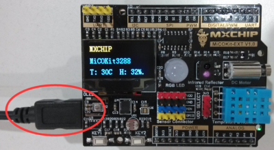

### 烧录APPLICATION

(1) 进入一个MiCO项目的根目录，例如：`cd helloworld`。（如果本地没有现成的MiCO项目，可以使用`mico new xxx`创建一个项目,或者使用`mico import xxx`从版本库导入一个项目）执行指令：`mico add https://code.aliyun.com/mico/FOG_V2.git`，从远程版本库中下载组件并且添加到当前项目；

(2) 修改工程文件fog_v2_config.h中的产品ID定义：`FOG_V2_PRODUCT_ID`为Fog云端产品创建时的相应值以及`ADAPT_MICO_SDK_VSERSION`为与相应版本的值；

(3) 工程编译，链接，下载至设备;

```
组件中内置示例程序：`FOG_V2/application/xxxxxxxx`，执行编译命令:

当基于MiCOKit开发板调试时（以MiCOKit-3165为例）：
如果使用Jlink仿真器， 命令： ` mico make FOG_V2.application.fog_v2_micokit_enjoy@MK3165 total download run `  
如果使用Stlink仿真器，命令： ` mico make FOG_V2.application.fog_v2_micokit_enjoy@MK3165 total download JTAG=stlink-v2 total run `

当基于Nucleo开发板调试时：
当使用Stlink仿真器时， 命令： ` mico make FOG_V2.application.fog_v2_nucleo_enjoy@NUCLEO_F411RE total download JTAG=stlink-v2-1 run `
详细的编译选项参考[MiCO Cude](https://code.aliyun.com/mico/mico-cube)
```

### 用户APP注册与登录
- 打开手机APP - “MiCO总动员”，并登录或注册。

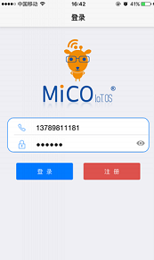    

- 如果用户在 MiCO 总动员 V2 版本下从未注册过，则需在登录界面中点击“注册”按钮，进入注册页面。
- 注册页面输入手机号，可获取手机验证码，然后完成验证，注册。
- 注册成功后，自动跳转到登录页面，并自动录入注册用户名和密码，点击登录后进入主页面。


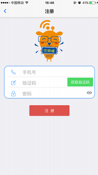

- 登录成功后，跳转至设备列表界面。


 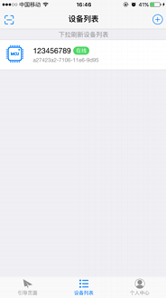


- 在设备列表界面，用户可以看到已绑定过的设备列表，列表中有设备名称、是否在线等信息。点击列表中某个设备可进入该设备详情页，进行设备控制。界面下拉可刷新设备列表。


### 设备配网与绑定
- 在设备列表的右上角有一个圈”+”，加号按钮，点击可进入配网页面，如下图。


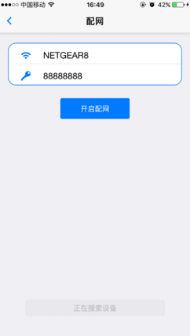

>  注意：配网页面中，WIFI 的 SSID 是自动获取的，密码则需要用户自行输入。
如果密码输入错误，则设备连接路由器会失败。保证输入的密码是正确的之后，点击开启配网按钮则可以发起配网操作。

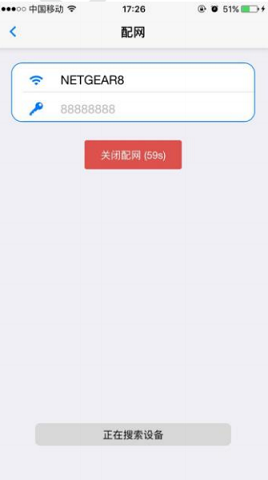

首先保证设备端上电，然后短按一下 Easylink 按钮，然后点击 APP 的开启配网操作。
开始配网之后，等待约 10s 钟，则 APP 可以发现一个新的设备。
配网过程中，可能会出现设备正在激活中，也可能由激活中跳变为未绑定，如图：
>注意：正常情况下，该设备是未绑定的，如果用户发现自身的设备已经被绑定，则可以通过长按Easylink 按钮触发设备自动解绑。

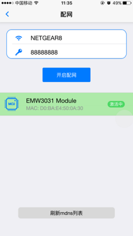    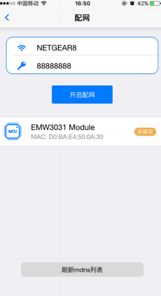

- 出现未绑定状态后，点击设备图标，即可变为已绑定状态，如图。

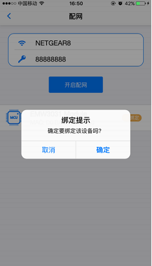  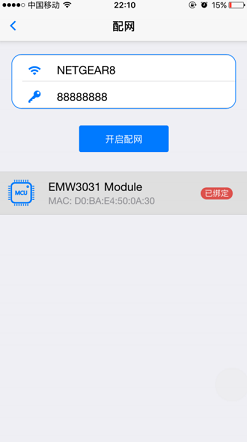


### 设备控制

- 在设备列表中，点击设备图标，可以进入设备详情页，在设备详情页中，用户可以获取 MiCOKit 开发板采集得到的温度、湿度、光照强度、红外线强度等值。同时用户可以控制电机和 RGB 灯。如图。

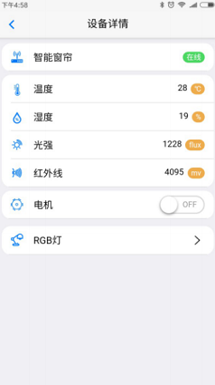   

- 通过点击彩虹圆中间的“开关”图标来开或关 RGB灯，点击色彩区域改变颜色， 通过滑动滑块调节饱和度和亮度。


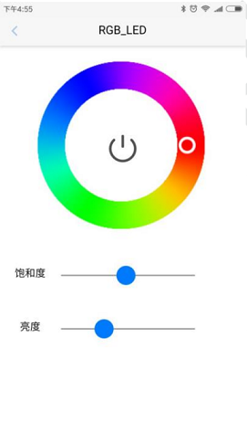    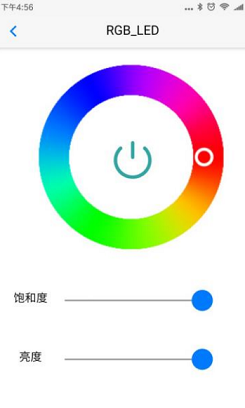

### 设备管理
- 在设备列表左滑，可以看到有 4 个设备管理图标，对应功能分别是：

 1. 设备重命名；
 2. 设备分享；
 3. 设备授权；
 4. 设备删除。
 
#### 1.设备重命名
- 每个用户都可以对自己绑定的设备进行重命名。考虑到 UI 显示，APP 限制设备名为 10 个字符长度内。


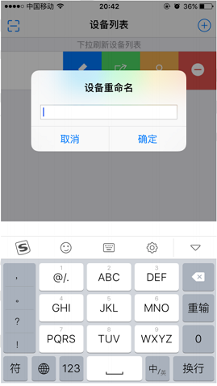


#### 2.设备分享

- 如果用户对某个设备是超级用户权限，则此用户可以将设备二维码分享给其他用户。


- 其他用户只需打开 MiCO 总动员 APP V2，进入设备列表页面，找到扫描 该二维码按钮，扫码按钮位于设备列表的左上角，如图中红色箭头标注。

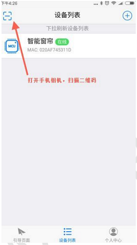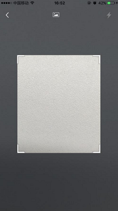


- 扫码后，用户即可在设备列表中发现该设备，并可对其进行控制。

#### 3.设备授权
- 超级用户可以对某个设备授权过的成员进行查看和解除授权，如图左滑出现删除按钮，点击即可删除已授权用户。


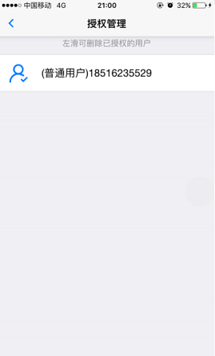  

#### 4.设备删除

- 设备列表中左拉模块名称，即可打开删除图标，如图中红色标注处：

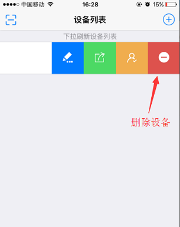

在 MiCO 总动员 APP V2 中，只用到了超级管理员和普通用户。

 - 第一次绑定某个设备的用户为超级用户，通过 APP 分享的用户为普通用户。
 - 如果超级用户删除某个设备，则该设备除了和超级用户解除绑定关系，还与被授权的其他普通用户之间解除关系。
 - 如果普通用户删除某个设备，则该设备只删除自身与设备建立的关系。


